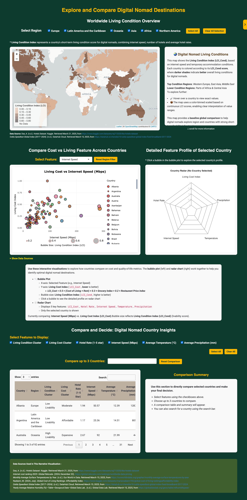
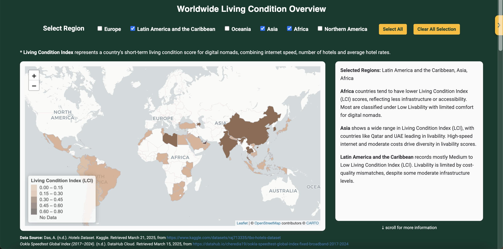

# Digital Nomad Destinations Visualisation

**An interactive dashboard for comparing short-term living conditions across countries, designed for early-stage digital nomads.**

---

## Project Overview

This project visualises and compares global destinations for digital nomads based on internet speed, cost of living, hotel quality, and climate. The app helps users make informed decisions about removte work locations.

- **Target Users:** Early-stage digital nomads who are seeking short-term destinations or planning to relacate.
- **Goal:** Provide evidence-based, multi-featured destination comparison, moving beyond single-factor rankings.

---

## Key Features

- **Choropleth Map:** Visualise Living Condition Index (LCI_Cond) by country and continent.
- **Cluster Exploration:** View clusters of countries by living conditions.
- **Bubble Plot & Radar Chart:** Compare countries across multiple features interactively.
- **Summary Table:** Numeric comparison with filtering and selection.
- **Full Interactivity:** Click, hover, select features, and get instant visual & numeric feedback.

---

## Data Sources
- [VisaGuide.World - Digital Nomad Index](https://visaguide.world/)
- [Ookla Speedtest Global Index](https://www.speedtest.net/global-index)
- [Numbeo Cost of Living](https://www.numbeo.com/)
- [Kaggle Hotels Dataset](https://www.kaggle.com/)
- [World Bank Climate Data](https://climateknowledgeportal.worldbank.org/)

---

## How to Use
1. **Clone this repository:**
   ```bash
   git clone https://github.com/yourusername/digital-nomad-visualisation.git
   cd digital-nomad-visualisation
   ```

2. **Open in RStudio of VS Code.**

3. **Install required packages:**
   ```R
    install.packages(c("shiny", "leaflet", "ggplot2", "plotly", "DT", "dplyr", "countrycode"))
   ```
4. **Run the application:**
    - Open `shiny_app/app.R` and click "Run App" in RStudio
    - Or run in terminal:
    ```R
    shiny::runApp("shiny_app")
    ```
5. **Explore the dashboard:**
    - *Use the choropleth map to view Living Condition Index (LCI_Cond) by country and explore regional patterns.*
    - *Click on a continent region to filter and update the grouped bar chart for detailed cluster-level comparison within that region.*
    - *Interact with the bubble plot to select countries and dynamically update the radar chart with their multi-feature profiles.*
    - *Use the feature selection menu to compare countries by different aspects (e.g., hotel rate, internet speed, temperature, precipitation.*
    - *Filter the summary table by feature or cluster and select countries for direct numeric comparison across all main attributes.*


---

## Screenshots

### 1. Overview Dashboard



This screenshot shows the main dashboard with the choropleth map, cluster exploration, and summary table.

### 2. Global Living Conditions Map



This choropleth map displays the Living Condition Index (LCI_Cond) by country, allowing users to visually assess global living conditions.

- Hover to view LCI Values
- Select regions to update analysis

### 3. Bubble Plot & Radar Chart


Compare countries by features using an interactive bubble plot.
Click a bubble to display the country's profile on the radar chart (right).

### 4. Country Summary Table


Directly compare up to 3 countries across all features and see an auto-generated summary of the key differences.

#### 5. Sidebar Navigation


The navigator allows users to select stage to move between different sections of the dashboard, including the choropleth map, bubble plot, radar chart, and summary table.


